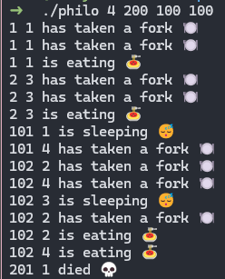

# 42-philosophers

## Table of Contents
- [Introduction](#introduction)
- [The dining philosophers problem](#the-dining-philosophers-problem)
- [Requirements](#requirements)
- [How to run](#how-to-run)

## Introduction
This project is an introduction into the topic of multithreading and implementation. For this purpose the dining philosophers problem is used to illustrate this concept.

## The dining philosophers problem
The [dining philosophers problem](https://en.wikipedia.org/wiki/Dining_philosophers_problem) is a famous problem in computer science used to illustrate common issues in [concurrent programming](https://en.wikipedia.org/wiki/Concurrency_(computer_science)). The following problem is stated as followed:
> "Five philosophers dine together at the same table. Each philosopher has their own plate at the table. There is a fork between each plate. The dish served is a kind of spaghetti which has to be eaten with two forks. Each philosopher can only alternately think and eat. Moreover, a philosopher can only eat their spaghetti when they have both a left and right fork. Thus two forks will only be available when their two nearest neighbors are thinking, not eating. After an individual philosopher finishes eating, they will put down both forks. The problem is how to design a regimen (a concurrent algorithm) such that any philosopher will not starve; i.e., each can forever continue to alternate between eating and thinking, assuming that no philosopher can know when others may want to eat or think (an issue of incomplete information)."

The problem was designed to illustrate the issue of deadlocks in concurrent programming. To avoid these, mutual exclusion, short mutexes", needs to be implemented to avoid deadlocks and race conditions. 

## Requirements

Following requirements should be considered:
- each philosopher should be a thread
- the program should take the following arguments: `number_of_philos`, `time_to_die`, `time_to_eat`, `numbe_of_times_each_philo_must_eat (can be NULL)`
- the number of philos is also the number of forks
- each philo should have an ID ranging from 1 to `number_of_philos`
- philo number 1 sits next to philo number `number_of_philosophers`. Any other philo number N sits between philo number N- 1 and philo number N + 1
- the program should display a log of the current events in the stdout
- data races and deadlocks should be avoided!

## How to run

1. Git clone this repository in your desired location
2. run `make` to compile the program, `re make` to recompile, and `fclean` to remove the program
3. run the program with the following arguments:
```
.\philo <num_of_philos> <time_to_die> <time_to_eat> <time_to_sleep> <[optional]num_times_must_eat>
```

Example:
```
./philo 4 200 100 100 1
```

Expected result:


